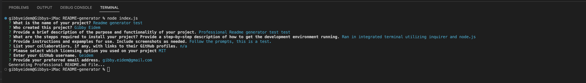

# Profesional README.md Generator

## Description

This application is a simple solution to creating a professional README.md for any project by providing the template needed making it easy to create a clean, professional README that can also be navigated through an interactive table of contents. This eliminates the need for needless typing to format your README every time you create a new project. With this application it is as easy as filling in the blanks. This project taught me how to utilize command line prompts and inputs using inquire to create a document and write it to a new file.

## Installation

This project uses the integrated terminal in vscode and requires inquirer as a dependency within. Use npm i in the terminal to install required dependencies

## Usage

after running npm i to install dependencies, simply run node index.js in your terminal and follow the prompts all the way through. The final result will lead to a new README.md to a dist folder.

## Credits

N/A

## License

MIT licensing information can be found in the LICENSE file accociated with this project.